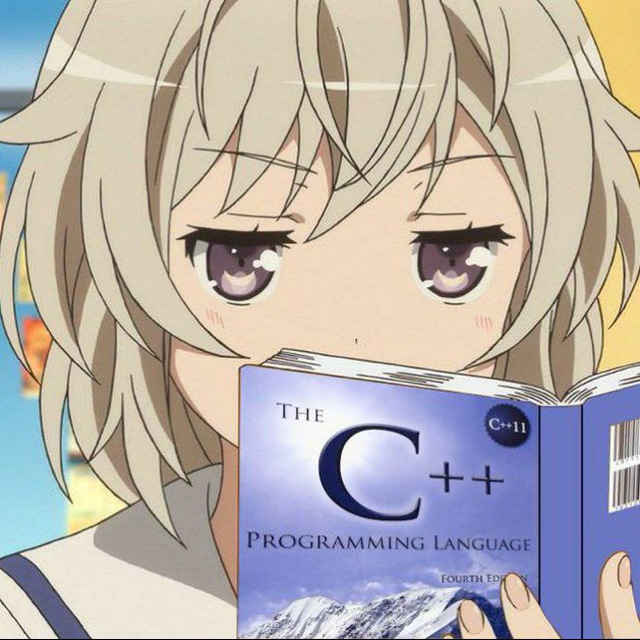

# **Lucy** - Telegram Bot (v2.4) <br>



A **simple** Telegram bot that sends daily reminders for upcoming exams and provides interactive commands for users. The bot is written in **JavaScript** using the `node-telegram-bot-api` library and runs **automatically at 05:30 AM** every day.

## 🚀 Features

- **Daily Reminders** – Auto countdown at **05:30 AM**.  
- **Smart Commands** – Quick access to exam updates & quizzes.  
- **Modular Design** – Clean `commands.js` for easy maintenance.  
- **Multiple Hosting** – Runs on **Railway, Render, Replit, Termux**.  
- **Cross-Platform** – Works on **PC, laptop, & mobile** with Node.js.  

---

## 🧑‍💻 Recent Updates (v2.4) – 24/02/2025

- New features available (onwer_id only) - like weather, dicitionary, eqn solver and so on...
- Daily Math quiz at **05:30 PM** with results after 3 hours.
- A random general NIMCET poll will be sent to the group at **09:00 PM**.

---

## 🔧 Installation

1. **Clone the repository:**  
   ```sh
   git clone https://github.com/pandit27/telegram_bot.git
   cd telegram-exam-reminder-bot
   ```

2. **Install dependencies:**  
   ```sh
   npm install
   ```

3. **Create a `.env` file** (optional, if using environment variables):
   ```env
   TOKEN = your_telegram_bot_token
   CHAT_ID = your_chat_id
   ```

---

## ⚙️ Configuration

1. **Get a Telegram Bot Token:**  
   - Open Telegram and search for `@BotFather`.
   - Use `/newbot` to create a bot and get a **BOT TOKEN**.
   
2. **Get the Chat ID:**  
   - Add `@getidsbot` to your group and get the **CHAT ID**.

3. **Modify `index.js` with your details:**  
   ```javascript
   const TOKEN = 'YOUR_BOT_TOKEN';
   const CHAT_ID = 'YOUR_CHAT_ID';
   ```

---

## 💻 Usage

Run the bot locally using:
```sh
node bot.js
```

---

## 📌 Commands

| Command    | Description                                   |
|------------|-----------------------------------------------|
| `/start`   | Welcome message & bot introduction.          |
| `/help`    | Lists all available commands.                |
| `/exam`    | CUET PG countdown.                           |
| `/nimcet`  | NIMCET exam countdown.                       |
| `/resources` | NIMCET 2025 study materials.               |
| `/quiz`    | Generates a random NIMCET quiz.             |

---

## 📄 License

This project is open-source and available under the **MIT License**.

---

💡 **Feel free to contribute, suggest new features, or report bugs!**

Thanks. 

Made by **Piyush Jha** with ❤️ & ☕. <br><br>
[Contact Owner](https://t.me/PV_027)  &nbsp;&nbsp;&nbsp;&nbsp;&nbsp; [Open Bot](https://t.me/pvnimcet2025_bot)   
